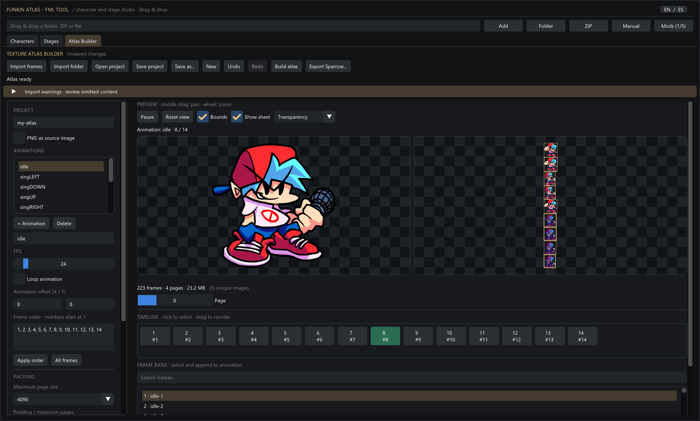
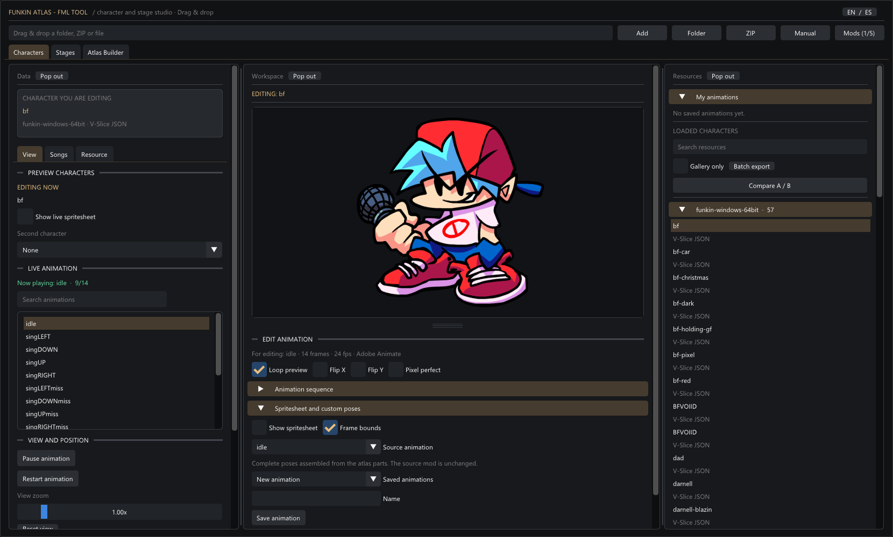
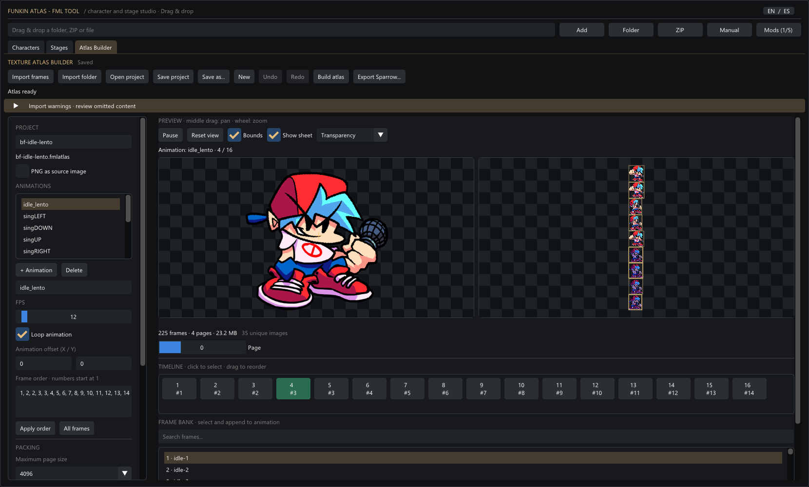
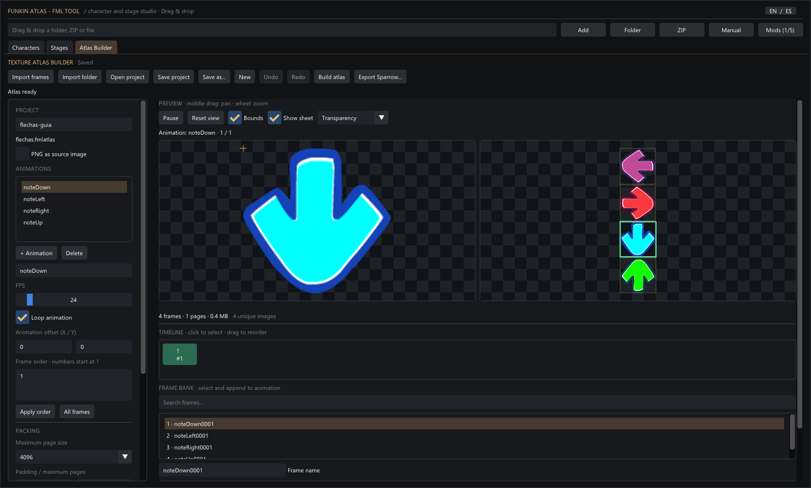
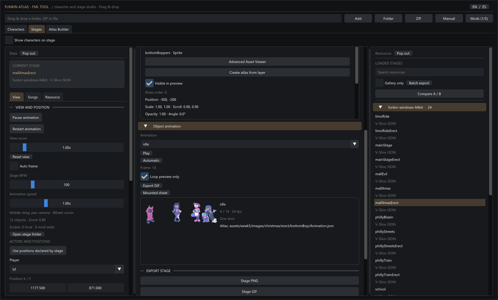
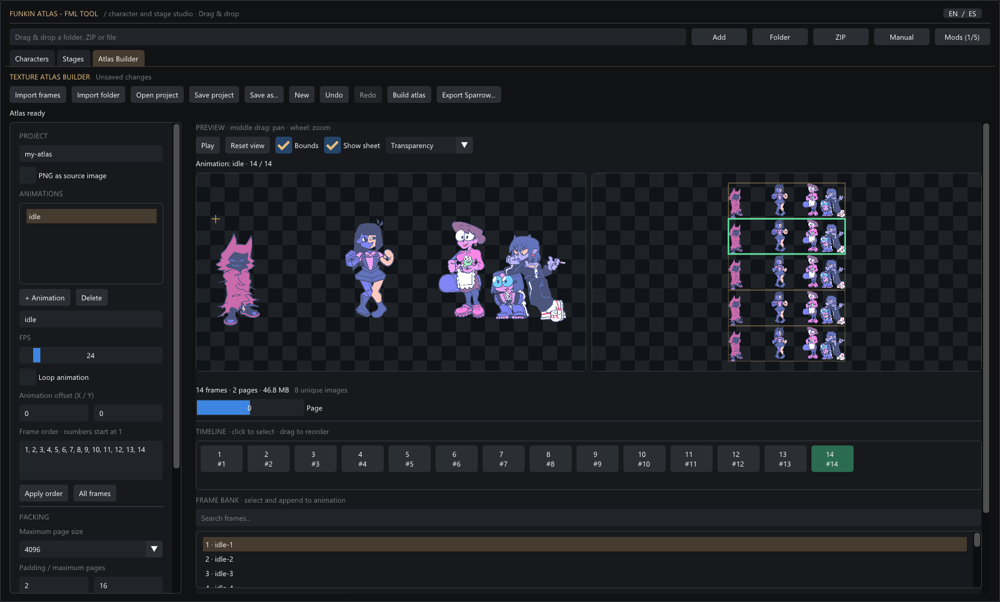
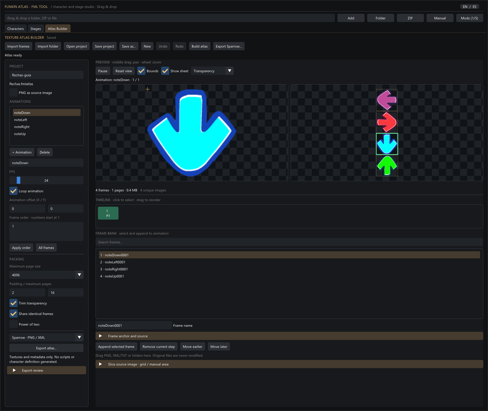
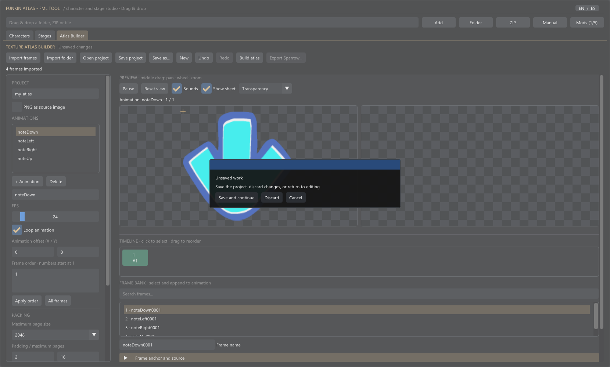
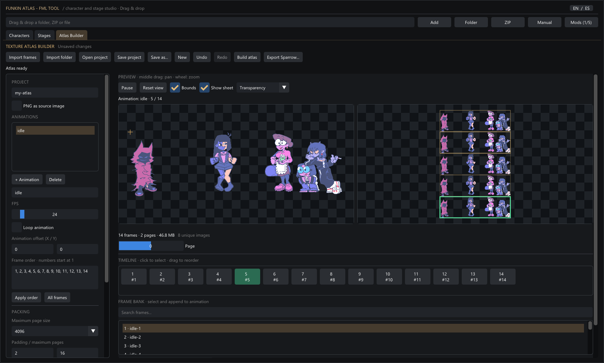

# Funkin Atlas 1.5 - Atlas Builder Advanced Guide

English offline edition. October 3, 2026.

FUNKIN ATLAS / CHARACTER AND STAGE STUDIO

## From game resources to your own texture atlas.

An illustrated advanced guide to importing complete poses, editing animation order, slicing images and exporting visual resources.



V-Slice base-game installation loaded. Nine real captures, linked from the accompanying AtlasBuilder-Guide-Images folder. No AI-generated illustrations. Keep that folder beside this Markdown file.

ATLAS BUILDER / 00

## 00. How to use this guide

The examples use an existing local V-Slice installation and Funkin Atlas 1.5. Switch the app to **EN** using the language button so the control names match. Your installation may contain a different frame bank, extra mods or different resource definitions.

| Chapter | What you will learn |
| --- | --- |
| 01 / Scope | What Atlas Builder creates, and what it does not. |
| 02 / Load the base game | Open BF and enter the builder without slicing Animate parts. |
| 03 / Frame bank and sequence | Understand source images, animation steps and packed pages. |
| 04 / Custom idle | Use repeated steps, adjust FPS and edit without deleting other animations. |
| 05-07 / Import, slice and align | Choose metadata, draw regions and preserve stable pose anchors. |
| 08-09 / Stage layer and packing | Resolve decorative layers and choose practical packing limits. |
| 10-12 / Save, export and validate | Protect editable work, connect textures to a target engine and reimport. |
| 13-14 / Troubleshooting and evidence | Understand limits and the exact scope of these checks. |

Use the chapter headings in your Markdown reader to navigate. Open each screenshot at full size to read small interface labels. Custom example identifiers such as **idle_lento** are resource names, not untranslated UI.

ATLAS BUILDER / 01

## 01. A texture builder, not a game engine

Atlas Builder gathers images or resolved poses into one or more PNG sheets, records their rectangles and preserves animation order. Use it for your own drawn animation, to repack existing frames, or to convert supported visual resources between Sparrow and Animate.

| Import | Edit | Deliver |
| --- | --- | --- |
| Numbered PNG sequences; Sparrow PNG/XML; Packer PNG/TXT; Animate folders and their spritemaps. | Frame order, repetitions, names, FPS, looping, anchors, animation offsets and manually traced regions. | An editable .fmlatlas project, or PNG/XML or PNG/JSON output with a manifest. |

> **Visual resources only.** The builder does not generate scripts, shaders, gameplay, or a complete character or stage definition. It does not reconstruct the original FLA or rig. A readable preview or successful structural validation does not replace testing inside the target engine.

Imports and edits work on the project. They do not overwrite the game resources used in this guide. Always export to a separate output folder and retain the originals.

ATLAS BUILDER / 02

## 02. Load the base game and resolve BF

**1.**  Run **FunkinAtlas.exe** with **SDL3.dll** beside it. The full FML suite is not required.

**2.**  Choose **Folder** and select the game folder containing **assets**. These captures use the local **funkin-windows-64bit** installation.

**3.**  Select **EN**, open **Characters**, and find **bf** in the resource list on the right.

**4.**  Right-click the BF entry and choose **Create atlas from character**. Wait for the import to finish.

**5.**  Review **Source warnings** before treating the result as complete. Use maximum page size **4096** to reproduce the four-page example.

> **This BF import is partial.** The example resolves 223 bank frames and 12 animations. Four death animations produce warnings for unsupported data or effects. The guide demonstrates supported animations, not a certified conversion of all of BF.

You can also open the builder without loading a mod and import your own images. Entering from the character is useful for Animate: it resolves complete poses instead of treating arms, faces and other spritemap pieces as individual animation frames.

WORKED EXAMPLE / NATIVE APPLICATION CAPTURE

### The loaded base game



BF is selected in Characters. The resource list and loaded-source controls identify the installation used for the example.

WORKED EXAMPLE / NATIVE APPLICATION CAPTURE

### Complete poses from an Animate character


BF in Atlas Builder: 223 output references, 35 unique images, four pages at maximum size 4096, and four source warnings. Review warnings even when the atlas builds.

ATLAS BUILDER / 03

## 03. One image is not one animation step

| Element | What it contains | Editing consequence |
| --- | --- | --- |
| Frame bank | Source images with a number, name and anchor. | A frame can be shared by multiple animations. Deleting it affects every reference. |
| Animation sequence | Ordered references to bank frames. | Removing one step does not delete its source image. A frame can appear repeatedly. |
| Packed page | A PNG sheet produced by Build atlas. | Rectangle placement does not define playback order. Identical pixels may be shared. |

In the sequence strip, the top number is the **step**. The bottom number, such as **#2**, is the **bank frame**. Two different steps can both reference #2. Select the exact step you intend to edit.

The animation preview, packed sheet and source-slicing view have independent cameras. **Middle-drag** pans and the **wheel** zooms; neither changes resource coordinates. **Reset view** resets the cameras.

Enable **Bounds** to inspect rectangles and the active frame. **Show sheet** toggles the packed-sheet view. Drag the vertical separator to resize the panel, and the handle under the canvases to adjust preview height. Narrow windows can switch between pose and sheet.

ATLAS BUILDER / 04

## 04. Build a slower idle with short holds

**1.**  Rename the project **bf-idle-lento**. Select **idle** and rename it **idle_lento**. Renaming changes that animation; it does not make a copy.

**2.**  Set **FPS** to **12** and enable **Loop animation**.

**3.**  Enter the order below under **Frame order** and press **Apply order**. In the guide installation, bank frames 1-14 form the idle.

**4.**  Press **Play** and inspect the holds on frames 2 and 3. Save, then **Build atlas** again before exporting.

```text
1, 2, 2, 3, 3, 4, 5, 6, 7, 8, 9, 10, 11, 12, 13, 14
```

There are 16 steps at 12 FPS, giving a cycle of approximately **1.33 seconds**. Repeating a number holds that image for another step. Frame numbers start at 1: do not use 0 or a packed-page index. If your bank differs, use its actual frame numbers.

For a separate animation, use **+ Animation** and append the required bank frames. **All frames** includes the entire bank, not just the previous animation. Avoid it when you only want a character idle.

### Editing without losing the other animations

-  Drag a sequence step onto another to reorder it, or use **Move earlier / Move later**.

-  **Remove current step** removes that occurrence; its bank image remains available.

-  Right-click a bank frame and choose **Delete from project** to delete the image and remap every animation. An animation left empty is removed.

-  **Delete** next to **+ Animation** removes the selected animation, not the image bank.

-  **Ctrl+Z** undoes a mistaken edit.

WORKED EXAMPLE / NATIVE APPLICATION CAPTURE

### A 16-step custom idle at 12 FPS



The prepared project is opened in the real app and retains the other animations. The 225 output references are not 225 different images: the atlas still contains 35 unique images.

ATLAS BUILDER / 05

## 05. Choose the right import source

| You have | How to open it | Important distinction |
| --- | --- | --- |
| Numbered PNG files | Import frames or Import folder. | Use consistent names such as idle_001.png. Natural ordering recognizes numbers. |
| Sparrow PNG + XML | Import the XML with its neighboring PNG. | The XML already defines frame rectangles; no arbitrary grid is needed. |
| Packer PNG + TXT | Import the TXT with its image. | The TXT must be atlas metadata, not a free-form instruction list. |
| A PNG without metadata | Enable PNG as source image before importing. | This preserves the whole image for slicing and ignores neighboring XML/TXT metadata. |
| An Animate folder | Import the folder or Animation.json. | Retain every spritemap JSON and PNG. Pose assembly follows the timeline, not a grid over parts. |
| An exported Atlas folder | Import the complete folder. | Include every page and atlas-manifest.json to recover animation settings. |

Drag and drop files or folders onto the builder tab. An import adds to the current project; **New** starts another project. Use **Open project** for a .fmlatlas file rather than importing it as a sheet.

WORKED EXAMPLE / NATIVE APPLICATION CAPTURE

### Four correctly separated note arrows



The base-game assets/shared/images/notes.xml metadata defines four arrow frames. The example creates one packed page without source warnings; the shapes are not cut into arbitrary cells.

ATLAS BUILDER / 06

## 06. Slice a grid or draw a precise region

Import a complete PNG with **PNG as source image** enabled. Select it in the bank and expand **Slice source image - grid / manual area** at the bottom of the workspace. Importing XML separates its poses; it does not necessarily retain the whole sheet as one bank image.

| Regular grid | Manual region |
| --- | --- |
| Set Cell X / Y, for example 32, 32. With Manual area disabled, click the desired cell. Check X, Y, width and height. Use Append selected crop or Extract full grid. | Enable Manual area and drag with the left mouse button over the source. Refine X / Y / width / height numerically, append the crop, and repeat for the other poses. |

Coordinates are image pixels, independent of zoom. Panning and zooming do not change the selected region. Full-grid extraction uses complete cells, left to right and row by row; incomplete edge cells are excluded. The original image stays in the bank and new crops are appended.

> **Not every sheet is a grid.** Use XML rectangles for irregular atlas frames. Use the Animate timeline or character adapter for piece-based rigs: cutting a face into a 32x32 cell does not reconstruct a pose. Before extracting an enormous sheet at 16x16, check the number of frames it would produce.

ATLAS BUILDER / 07

## 07. Keep poses aligned, not just the camera

**Camera position** only affects inspection. **Anchor X / Y**, under **Frame anchor and source**, places a bank image in pose space. **Animation offset** adjusts the selected animation: its preview uses the frame position minus this offset.

**1.**  If the feet jump, pause and compare consecutive steps.

**2.**  Check their frame anchors before moving the camera. One edited anchor is shared by every animation referencing that frame.

**3.**  Duplicate the bank frame if another animation needs an independent anchor.

**4.**  Use an animation offset to align the whole animation, not to assign different corrections to every frame.

With **Trim transparency**, the packer removes fully transparent outer margins while retaining position information. Sparrow uses a common logical canvas for each animation. When integrating, use the **offsets** from that export's manifest; do not blindly copy the source offsets or those of another format.

> **Alignment is part of the integration.** A well-centered preview is not proof that the target game will use the same origin. Compare the pose support point after reimporting, and again inside the destination engine.

ATLAS BUILDER / 08

## 08. Create an atlas from a decorative stage layer

**1.**  Open **Stages** and select **mallXmasErect**.

**2.**  Select **bottomBoppers** in the hierarchy on the left. Scroll the panel if necessary.

**3.**  In the central **Layer details**, choose **Create atlas from layer**, next to Advanced asset viewer.

**4.**  Review the resolved animation, adjust FPS or looping if needed, set maximum size to **4096**, then build.

This acts on decorative layers, not the preview actors BF, GF or the opponent. The example resolves **14 poses, eight unique images and two packed pages**. It uses the complete resource, not the portion visible inside the stage camera.

> **A layer export is not a complete stage.** Scene position, scale, scroll factors, draw order and scripts still need integration in the target stage. Unsupported effects can make an approximate preview look acceptable without guaranteeing faithful assembly or export.

WORKED EXAMPLE / NATIVE APPLICATION CAPTURE

### Enter the builder from Layer details



mallXmasErect with bottomBoppers selected. The central inspector contains the layer-to-builder action; the hierarchy identifies the decorative layer.

WORKED EXAMPLE / NATIVE APPLICATION CAPTURE

### A resolved stage animation



The complete bottomBoppers poses are assembled into two pages. Maximum page size is 4096; the source animation has 14 steps and eight unique images.

ATLAS BUILDER / 09

## 09. Pack for quality and compatibility

Choose the output format and packing settings in the left panel, then press **Build atlas**. An edit after building makes the packed result stale; build again before exporting.

| Setting | Purpose | Practical choice |
| --- | --- | --- |
| Maximum page size | Limits each sheet, without scaling the drawings. | Start at 2048; use 4096 for large poses. Actual pages may be smaller than the maximum. |
| Padding | Separates packed rectangles. | The initial value is 2 pixels. Padding does not promise edge extrusion. |
| Maximum pages | Caps the number of generated sheets. | Use 1 for single-atlas loaders. Maximum: 32 Sparrow pages or 8 Animate pages. |
| Trim transparency | Removes empty outer pixels. | Usually saves space. Preserve exported anchors and offsets when integrating. |
| Share identical frames | Reuses matching pixels. | Retains repeated animation steps while reducing unique image storage. |
| Power of two | Rounds sheet dimensions to powers of two. | Use when required by the loader or pipeline; it can increase memory and file size. |

### Review the result before exporting

Expand **Export review** to inspect page dimensions, freshness and warnings. The MB figure for packed pixels describes uncompressed image memory, not the final PNG file size. A 4096x4096 RGBA page is about **64 MiB** before compression; moving to 8192x8192 is not a free solution.

If packing fails, check the largest pose, enable trimming and deduplication, allow more pages, or split the project. A single image larger than the maximum page cannot fit merely by allowing more pages.

WORKED EXAMPLE / NATIVE APPLICATION CAPTURE

### Inspect the lower packing controls



The taller capture shows format, page-size, trimming and deduplication controls. Scroll the left panel in a shorter window. The arrows example has one page and no source warnings.

ATLAS BUILDER / 10

## 10. Save editable work and protect it

**Save project** or **Ctrl+S** writes a portable **.fmlatlas**: images, bank frames, animations, anchors, format options and source warnings. **Open project** restores these data; the undo history starts fresh.

**Save as...** creates a copy under another name. The project name influences the exported atlas folder, but does not replace selecting a project save path.

**Ctrl+Z** undoes. **Ctrl+Y** or **Ctrl+Shift+Z** redoes. History holds up to 48 states within a memory budget; large imports can shorten it.

New, opening another project or closing with unsaved changes prompts you to save, discard or cancel. Cancel returns to the current work. A local recovery copy may offer **Recover last work** in an empty builder, but it is not a substitute for explicit saves and versions.

> **Project versus export.** Keep the .fmlatlas project if you want to continue editing later. Exported textures are integration artifacts, not a guaranteed replacement for the editable source. This version stores local settings and recovery data under %LOCALAPPDATA%\FunkinAtlas2.

WORKED EXAMPLE / NATIVE APPLICATION CAPTURE

### The unsaved-work protection



Save and continue preserves the changes before the pending action. Discard proceeds without them. Cancel keeps the current project open.

ATLAS BUILDER / 11

## 11. Export textures, then connect them to the engine

**1.**  Save the editable project.

**2.**  Choose **Sparrow - PNG / XML** or **Animate - PNG / JSON**. Build again and inspect the review.

**3.**  Use **Export atlas...** and select a dedicated output folder outside the originals.

**4.**  Read **README.txt** and **atlas-manifest.json** in the generated folder.

A new format-suffixed folder is created. Repeated exports add a numeric suffix and preserve the earlier result.

| Sparrow output | Animate output |
| --- | --- |
| my-atlas-sparrow/<br>my-atlas-1.png + my-atlas-1.xml<br>my-atlas-2.png + my-atlas-2.xml<br>atlas-manifest.json<br>README.txt | my-atlas-animate/<br>Animation.json<br>spritemap1.png + spritemap1.json<br>spritemap2.png + spritemap2.json<br>atlas-manifest.json<br>README.txt |

Sparrow exports one PNG/XML pair per page. Its manifest records exact prefixes, FPS, looping and adjusted offsets. Multiple pages require a compatible multi-atlas loader. Animate exports complete raster poses, not the original piece rig. Its root timeline runs at 24 FPS; configure each animation's FPS when consuming it.

ENGINE INTEGRATION / VISUAL DATA ONLY

## What still needs connecting

| Destination | Work the builder does not perform |
| --- | --- |
| Psych | Create or adapt the character JSON or stage, declare images and prefixes, and apply FPS, loop and offsets. Do not assume every Psych version supports Animate or multiple sheets. |
| Codename | Create or adapt the XML/resource definition, declare the atlas, animations and anchors, and connect the layer or actor to its scene. Verify the loader in the build being used. |
| V-Slice | Create or adapt the JSON definition, paths, render type and animation lookup. Keep character logic and stage configuration separate. |

> **Do not copy only the PNG.** Metadata and the engine definition give the frames their meaning. Use the names, prefixes and offsets of the selected output. nativeOffsets and origin describe the source and are not automatically interchangeable across formats. The Atlas manifest is not a universal game-readable character definition.

This guide does not certify a newly generated atlas inside any of the three engines. A successful build and reimport prove a narrower result. Integrate and run the resource in the exact destination version before calling it game-ready.

ATLAS BUILDER / 12

## 12. Reimport before you deliver

**1.**  Save, then create a new project.

**2.**  Choose **Import folder** and select the complete exported folder.

**3.**  Check names, step counts, FPS, looping, offsets and warnings. Include all sheets and the manifest.

**4.**  Build and inspect each packed page. **Page** is zero-based: 0 is the first sheet.

**5.**  Compare first and last poses, holds and support points. Then test the integrated definition inside the target game.

-  Image rectangles stay inside their declared sheets.

-  Animation order and repeated holds match the intended sequence.

-  Missing images or animations are explained, not silently ignored.

-  Warnings were reviewed even if the build succeeded.

-  The target loader supports the format and every page, with correct paths and exported offsets.

WORKED EXAMPLE / NATIVE APPLICATION CAPTURE

### A real Animate round trip



The exported bottomBoppers Animate folder is reimported and rebuilt with 14 steps, eight unique images and two pages. Reading the export is not equivalent to running the stage in the game.

ATLAS BUILDER / 13

## 13. Troubleshooting and current limits

| Symptom | First check |
| --- | --- |
| The whole sheet appears as one pose. | Missing XML/TXT, or PNG as source image was enabled. Import metadata for separate frames. |
| Loose faces or arms appear. | A spritemap PNG was imported as an ordinary sheet. Use Animation.json, its folder, or Create atlas from character. |
| Playback does not restart. | Check Loop animation. Without looping it stops at the end; Play can restart it. |
| Export is disabled or fails. | Rebuild after edits; inspect errors, page limits and unsupported source features. |
| The converted pose jumps. | Check anchors, logical canvas and offsets from the chosen export, not just the source. |
| Reimport loses animations. | Import the entire folder with every page and manifest. Check original source warnings too. |
| Frame order is rejected. | Use valid bank numbers starting at 1, separated by commas or spaces. Do not enter ranges such as 1-14. |
| A complex Animate is rejected. | Unsupported masks, filters, data or depth can prevent reliable mounting. An approximate preview is not proof of export fidelity. |

Current bounds: **1,024 bank frames; 256 animations; 4,096 total output steps; 8,192 pixels per side; up to 32 Sparrow pages or eight Animate pages.** Source pixels and output pixels each have a 256 MiB operation budget. This is not a guaranteed global RAM cap. Leave headroom and split large projects.

ATLAS BUILDER / 14

## 14. What was verified for this guide

All nine figures are native Funkin Atlas captures, now in English, with the local V-Slice installation loaded. No generated illustrations or reconstructed UI mockups are used. The prepared idle was made using the shared project model and opened in the app; these are not a recording of every manual click. Instructions were checked against the available controls.

Private examples for original BF, the custom idle and note arrows were saved, reopened and compared for decoded pixels and metadata. **470 checks passed.** The guide captures and the stage-layer Animate reimport completed successfully. Source game files were not changed.

| Evidence | Does not establish |
| --- | --- |
| Project save/open comparisons and atlas builds. | That every source animation or unsupported effect can be converted. |
| A visible native preview and structural round trip. | That a newly exported resource has been injected and executed inside a target engine. |
| A local base-game installation used for examples. | That every user installation has the same frame indices or resource definitions. |

This Markdown guide and its accompanying images contain documentation and screenshots only. It does not distribute original sheets, image-embedded example projects or a copy of the game. Game artwork belongs to its respective creators; Funkin Atlas is the inspection and authoring tool.

> **Finish with a reproducible handoff.** Deliver the atlas folder, its manifest, a compatible engine definition and the editable project when appropriate. State which source warnings remain and which destination build was tested. That is more useful than describing an untested export as universally compatible.
