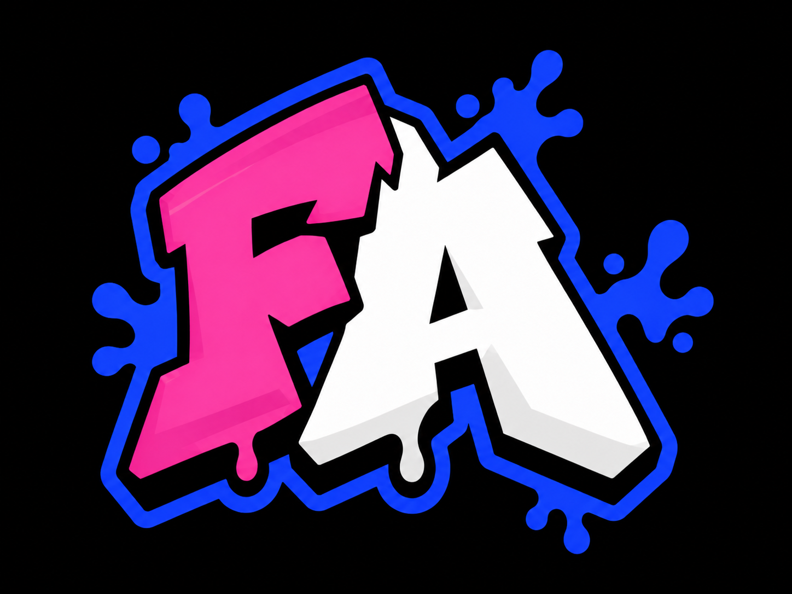
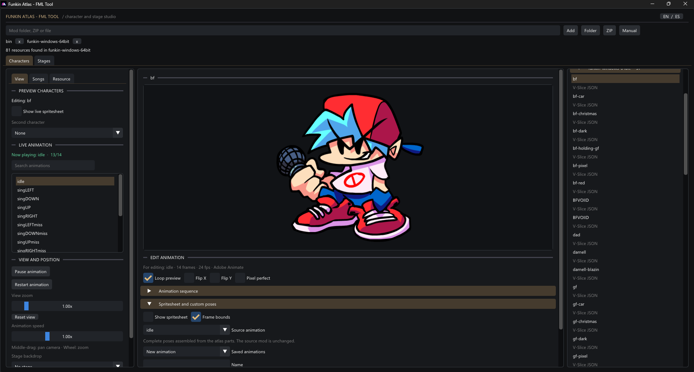

# Funkin Atlas - FML Tool

   

Explore the characters, animations, spritesheets, and stages inside Friday Night Funkin' mods—without opening the full FML editor. Funkin Atlas is a portable Windows app with a character studio, a stage inspector, and optional song-driven animation previews.

*App screenshot provided for demonstration. Game and mod artwork visible in it belongs to its respective creators; it is not included as reusable art in this release.*

## Start here

1. Extract the ZIP, keeping `FunkinAtlas.exe`, `SDL3.dll`, and the `media` folder together.
2. Run `FunkinAtlas.exe` on Windows x64. Installation and Python are not required.
3. Choose **Folder**, **ZIP**, or **Manual**. Manual mode lets you select a character or stage definition and its visual files from different folders.
4. Switch between **Characters** and **Stages**. Use the right-hand list to choose a resource and the left-hand controls to inspect it.

The app starts in English. Use **EN / ES** in the upper-right corner to switch to Spanish.

## What you can do

| Characters | Stages | Songs |
| --- | --- | --- |
| Play animations; inspect an optional live spritesheet; create and save custom poses; preview two characters; export GIF, PNG, or mounted sheets. | Inspect the draw-order hierarchy, sprite sources, positions, visibility, and animations; preview characters on stage; export the scene or selected visual assets. | Load a discovered chart and audio, including V-Slice Erect/Nightmare and separate character vocals; route strumlines and save note/idle animation presets. |

Funkin Atlas can open up to three mod sources at once and detects supported resources from Psych Engine, Codename Engine, and V-Slice. You can keep favorite resources in a local gallery. Availability depends on the files actually present in each mod; a custom runtime-only effect may not appear in the static preview.

> [!IMPORTANT]
> The app does **not execute mod scripts, cutscenes, or mechanics**. Converted engine exports contain visual/decorative content only. Test an export in its target engine before sharing it.

## Your files and privacy

Previews and gallery operations do not modify the source mod. Your gallery, saved animations, and song-animation presets are stored outside this portable folder in `%LOCALAPPDATA%\FunkinAtlas\gallery.json`. If you move or delete a mod, the gallery may ask you to relink its source. To remove the app, delete the extracted folder; delete the gallery file separately only if you also want to erase those saved choices.

Source code and build instructions are distributed separately in `FunkinAtlas-source.zip` or the `Developer` folder. The application code is MIT-licensed; bundled dependencies retain their own licenses in `THIRD_PARTY_NOTICES.md`.

## Español

Funkin Atlas es una app portable para Windows x64 que permite explorar personajes, animaciones, hojas de sprites y escenarios de mods de Friday Night Funkin' sin abrir el editor completo de FML. La captura anterior muestra la aplicación; el arte del juego o de mods que aparece en ella pertenece a sus autores y no se distribuye como recurso reutilizable.

1. Extrae el ZIP manteniendo juntos `FunkinAtlas.exe`, `SDL3.dll` y la carpeta `media`.
2. Abre `FunkinAtlas.exe`. No requiere instalación ni Python.
3. Usa **Folder**, **ZIP** o **Manual** para cargar un mod o archivos concretos. En Manual puedes indicar definición, imagen y atlas aunque estén en carpetas distintas.
4. Explora las pestañas **Characters** y **Stages**. El selector **EN / ES** cambia el idioma.

Puedes abrir hasta tres fuentes, inspeccionar la jerarquía de un escenario, reproducir animaciones, crear poses propias, guardar favoritos y usar canciones para accionar animaciones por tecla. En V-Slice admite Erect, Nightmare y voces separadas por personaje cuando existen. Soporta recursos detectables de Psych, Codename y V-Slice. La disponibilidad real depende de los archivos de cada mod.

**Límite importante:** la vista no ejecuta scripts, cinemáticas ni mecánicas. Los paquetes convertidos entre motores solo incluyen lo visual/decorativo; pruébalos en el motor elegido antes de distribuirlos. La app no modifica el mod de origen. La galería y los presets se guardan en `%LOCALAPPDATA%\FunkinAtlas\gallery.json`, fuera de la carpeta portable. Si cambias de lugar un mod, podrás volver a enlazar su ruta.
